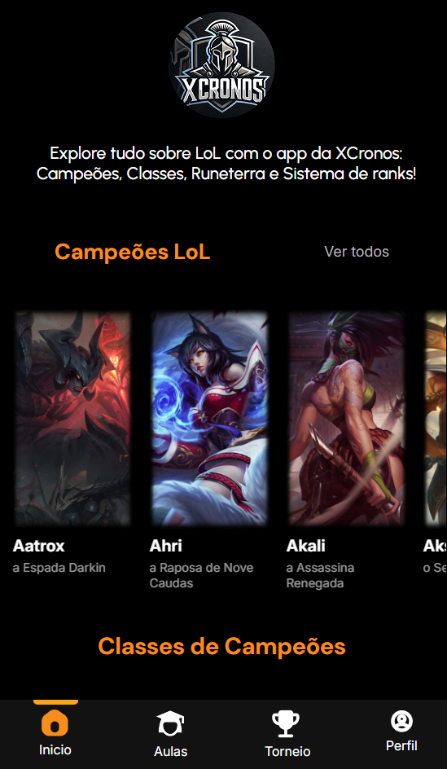
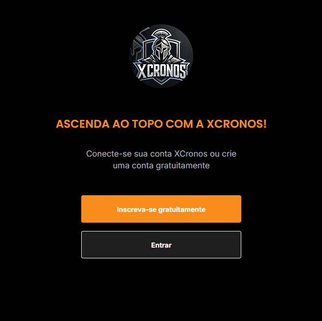
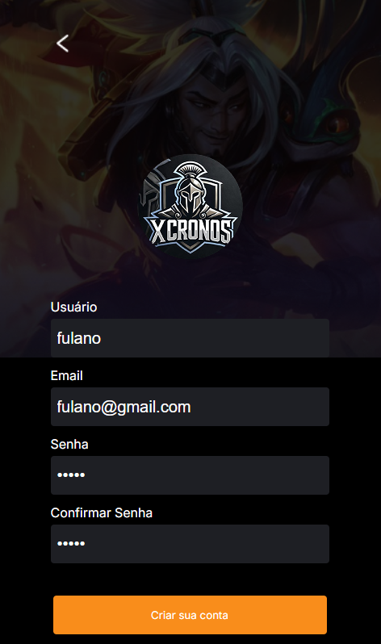
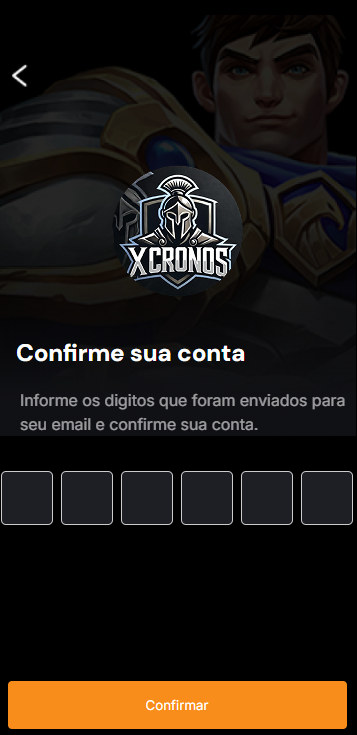
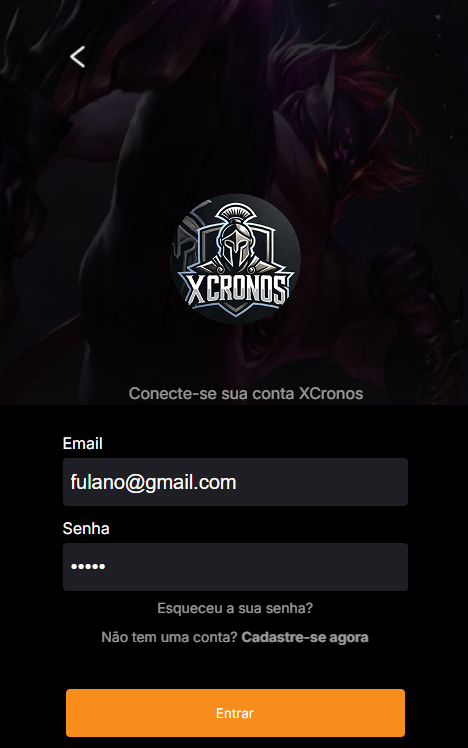
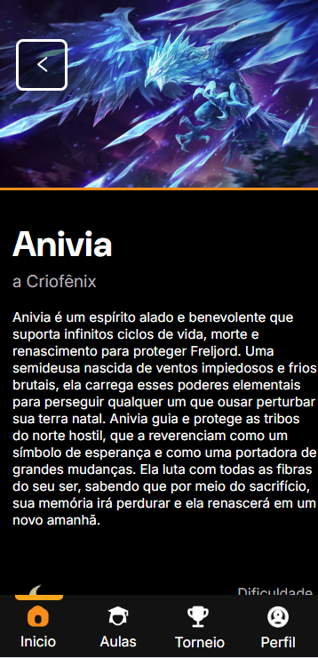

# Projeto XCronos 🎮  

Explore tudo sobre League of Legends com o XCronos! Descubra informações sobre **Campeões, Classes, Runeterra e o Sistema de Ranks**. Além disso, participe de **aulas e torneios** para aprimorar suas habilidades no jogo.  

---

## 🚀 Tecnologias Utilizadas  

### 🖥️ Backend (O coração do XCronos)  

> **Node.js** 🟢 *(O pai do backend, gerenciando toda a aplicação)*  

🔹 **Frameworks e bibliotecas utilizadas:**  
- **Express** – Estrutura para gerenciar rotas e requisições  
- **Knex.js** – Construtor de queries SQL para comunicação com o banco de dados  
- **MySQL2** – Driver para conectar ao banco de dados  
- **Jsonwebtoken** – Autenticação JWT para segurança  
- **Bcryptjs** – Criptografia de senhas  
- **Cors** – Permissão de acesso entre aplicações  
- **Dotenv** – Gerenciamento de variáveis de ambiente  
- **Nodemailer** – Envio de e-mails  

---

## 🗄️ Banco de Dados (MySQL)  

O banco de dados do XCronos gerencia **usuários, torneios e inscrições**.  

🔹 **`usuarios`** – Armazena dados dos jogadores, incluindo nome, e-mail, senha criptografada e status de verificação.  

🔹 **`torneios`** – Registra os torneios, incluindo nome, data, horário e premiação.  

🔹 **`inscricoes`** – Controla as inscrições nos torneios, vinculando usuários aos eventos com informações do **Discord e nickname no jogo**.  

📌 **Torneios cadastrados:**  
- 🏆 **Howling Abyss 1x1** – 22/03/2025, prêmio: **R$100,00**  
- 🏆 **Summoner’s Rift 1x1** – 23/03/2025, prêmio: **R$100,00**  

---

### 🎨 Frontend  

🔹 **Requisições via Fetch API** para consumir as APIs criadas no backend  
🔹 **[DDragon API do League of Legends](https://developer.riotgames.com/docs/lol)** *(API gratuita utilizada para obter informações dos campeões, skins e habilidades do jogo)*  

---

## 🔐 Autenticação (Cadastro e Login)  

O sistema de login permite a autenticação segura dos usuários.  

  
    
    
    
    

 

---

## 🔍 Campeões  

A seção de Campeões traz informações detalhadas sobre cada personagem de League of Legends.  

  

---

## 📩 Contato  

Caso tenha dúvidas ou sugestões, sinta-se à vontade para entrar em contato!

